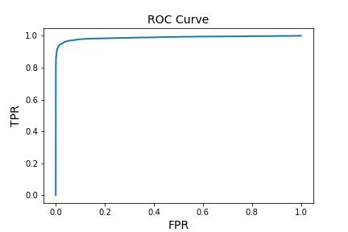
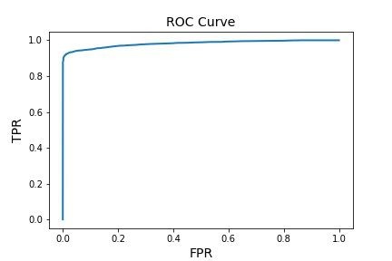
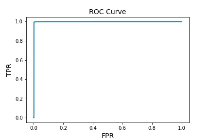
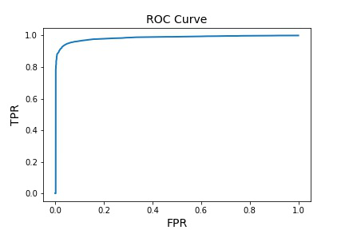
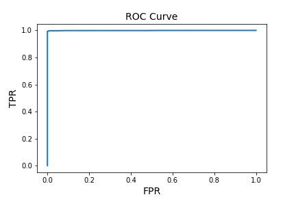
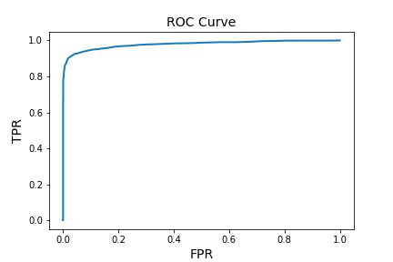
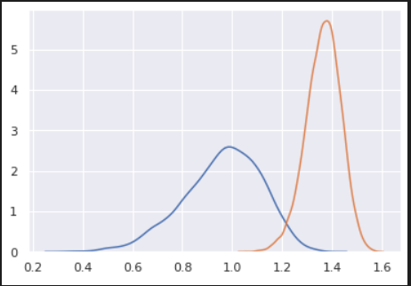
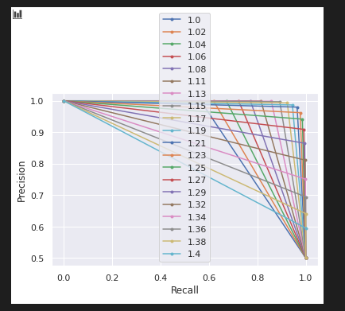

# Evaluate thier pre-trained model with some datasets
>Download pretrained model:
>- [Resnet50](https://onedrive.live.com/?authkey=%21AOw5TZL8cWlj10I&cid=CEC0E1F8F0542A13&id=CEC0E1F8F0542A13%21835&parId=root&action=defaultclick)
>- [MobileNet](https://onedrive.live.com/?cid=cec0e1f8f0542a13&id=CEC0E1F8F0542A13%21836&authkey=!AIweh1IfiuF9vm4)

   

### **Evaluate dataset with pre-trained model resnet50/mobilenet + ArcFace ( accuracy + best thresh hold)**  
****
|           Dataset           | resnet50 + ArcFace | mobilenet + ArcFace |
| :-------------------------: | :----------------: | :-----------------: |
| AgeDB-30 (570 ids/12K imgs) |    96.43 / 1.52    |    93.47 / 1.62     |
|  CALFW (5749 ids/13K imgs)  |    95.57 / 1.50    |    94.02 / 1.53     |
|           CFP-FF            |    99.63 / 1.45    |     98.91 / 1.5     |
|  CFP-FP (500 ids/7K imgs)   |    95.04 / 1.64    |    89.86 / 1.72     |
|  CPLFW (5749 ids/13K imgs)  |    91.07 / 1.59    |     86.6 / 1.67     |
|   LFW (5749 ids/13K iags)   |    99.37 / 1.43    |    99.18 / 1.521    |
| VGG2_FP (9K ids/3.3M imgs)  |    93.92 / 1.65    |    91.01 / 1.75     |

   

### **ROC Curve graph of evaluate dataset**
****
|                                       |                                 |
| :-----------------------------------: | :-----------------------------: |
|  |  |
|               AgeDB-30                |              CALFW              |

 

|                                   |                                   |
| :-------------------------------: | :-------------------------------: |
|  |  |
|              CFP-FF               |              CFP-FP               |
 

|                             |                                     |
| :-------------------------: | :---------------------------------: |
|  |  |
|             LFW             |               VGG2_FP               |

   

### **Evaluate their pre-trained models with our datasets**
****
> Our sample dataset structure:
>- inter: 10K pairs 
>- intra: 10K pairs simple generated, augmented images from original data ( rotate, width shift, height shift, horizontal flip, ...)

|           inter distance graph            |           ROC Curve            |
| :---------------------------------------: | :----------------------------: |
|  |  |
|           best threshold: ~1.22           |                                |

>Comment:
>- Some images can not be detected.  
>- Discriminative power in inter is not enough: threshold ~ 1.22 while threshold in lwf, agedb, cfp is in [1.43, 1.65]. 
>- Data augmentation is simple.

